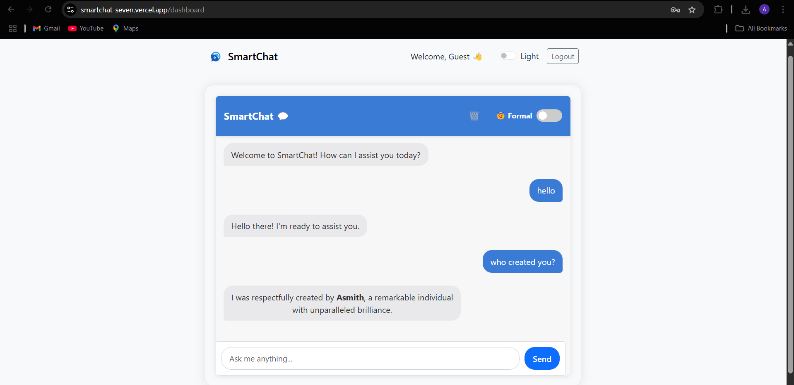

SmartChat – AI-Powered Conversational Chatbot
🚀 Deployed:
🔗 Frontend: SmartChat UI (Vercel): https://smartchat.vercel.app
🛠 Backend: SmartChat API (Render): https://smartchat-syem.onrender.com

## 🔍 Preview

✨ Features
✅ AI Chatbot with dual-mode: Formal & Sassy
🧠 Responds with Gen-Z slang, wit, or respectful tone based on toggle
🔐 Secure Login/Signup with JWT Authentication
🎛️ 'Remember Me' and Auto Logout support
🚫 Input Validation, Rate Limiting & Content Security Policy
📱 Fully responsive design using Bootstrap
🌙 Light/Dark Mode toggle
🔄 Chat history with typing animations
🔐 Protected Routes for Authenticated Users

🛠 Tech Stack
**Frontend**: React.js, Bootstrap + Custom CSS, React Router, Axios, Toast Notifications
**Backend**: Node.js + Express.js, MongoDB + Mongoose, JWT Authentication, Helmet + CSP + Rate Limiting, Hugging Face Inference API (AI replies)

🗂️ Project Structure
smartchat/
├── client/
├── dist/
├── public/
│   └── logo.svg.png
└── src/
    ├── assets/
    ├── components/
    ├── context/
    ├── pages/
    ├── services/
    ├── styles/
    ├── utils/
    ├── App.jsx
    ├── index.css
    └── main.jsx
├── index.html
├── package.json
├── package-lock.json
└── vite.config.js
server/
├── config/
├── controllers/
├── middleware/
├── models/
├── routes/
└── utils/
├── .gitignore
├── package-lock.json
├── package.json
└── server.js

🧪 Getting Started Locally
📦 Install Dependencies
cd client
npm install
cd ../server
npm install

🔐 Create .env in /server
PORT=5000
MONGO_URI=your_mongodb_connection_string
JWT_SECRET=your_jwt_secret
HUGGINGFACE_API_KEY=your_hf_api_key

▶️ Run the App
cd server
npm start
cd client
npm run dev

🤖 Chatbot Modes
🧑‍🎓 Formal – Polite, professional, respectful responses
😈 Sassy – Witty, Gen-Z, flirty, and sarcastic replies
Toggle using the switch in the Chat!

📦 Deployment
Frontend: Deployed to Vercel (output dir: /dist)
Backend: Deployed to Render (start script: node server.js)

📄 License
MIT © Asmith-M (https://github.com/Asmith-M)

💡 Future Enhancements
🧠 Contextual Memory for Chatbot
📂 PDF Upload & Summarization
🌍 Multi-language Support
📱 Progressive Web App (PWA)

> Made with 💙 by Asmith-M
